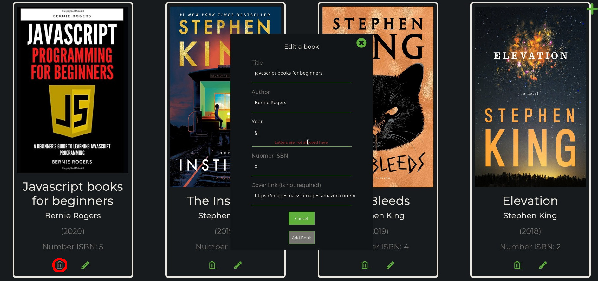

# BOOK LIST with REST API using JSON Server and Webpack

With this application we can management a book's that are store in json file as a database. We can add a book by a form, delete or edit from UI.

This application is created in vanilla javascript using webpack and webpack-dev-server to compile and share. Book list have a back-end. I used a json server application for the asynchronous and managemnt.

### Technologies used in project

- JavaScript
- Json Server (as back-end)
- Webpack
- Webpack-dev-server
- Sass

## Table of contents

- [Installation](#installation)
- [Start json server](#start-json-server)
- [Run live server](#run-live-server)
- [Add a book](#add-a-book)
- [Edit a book](#edit-a-book)
- [Delete a book](#delete-a-book)
- [Application tools](#application-tools)
- [Inspiration](#inspiration)

## Setup

### Installation

To run this project install the dependencies

```
$ cd ../directory_path
$ npm install
```

### Start json server

To run json server type in console:

```
$ npm run json:server
```

### Run live server

```diff
! Attention
```

Use new tab at console to run live server. Json server need to be run in background.

At a new tab console remember to change a directory of project path

```
$ cd ../directory_path
```

For live server is used webpack-dev-server to run in type at console:

```
$ npm start
```

It will open default browser as a localhost

## How it works...

The user interface is designed to be as easy to use as possible

### Add a book

At right in the corner there is a plus icon that allow to add a new book it will appear a form. It contains a fields with a title, author, year, isbn and link for a cover.


The form has validations secure to add a book and regular expressions were used for this, example: in the "Year" field letters cannot be used or the field with the link must start with "http:// or https://"

#### Code Example

`if (link.value && !/^https?:\/\/[\w.\/]+/i.test(link.value)) {...}`


### Edit a book

Every book that has been added have a button for editing. You can edit any field but still validation is working and checking the fields are correct field. When book is edit, delete button is current disabled it protect from delete a book while editing.



### Delete a book

If we wanna delete a book from json file, just press trash icon and application will ask you to confirm this action.

### Application tools

The application has helpful tools such as sorting books by year of publication or sorting the list in alphabetical order. Another tool is a search engine that searches for a book by the phrase of the book title.

## Inspiration

This app is based on tutorial from [@Brad Traversy](https://github.com/bradtraversy)
